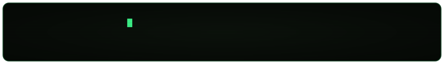

<!--
  maxym@archbox — GitHub profile README
  Aesthetic: CRT terminal / Arch Linux. All headers/cards are hand-built,
  self-hosted animated SVGs in ./assets (they animate on GitHub via ).
  The contribution snake is generated by .github/workflows/snake.yml into the
  `output` branch (broken until that workflow runs once).
-->

  

&nbsp;

&nbsp;

<!-- contribution snake — generated into the `output` branch by .github/workflows/snake.yml -->

&nbsp;&nbsp;

